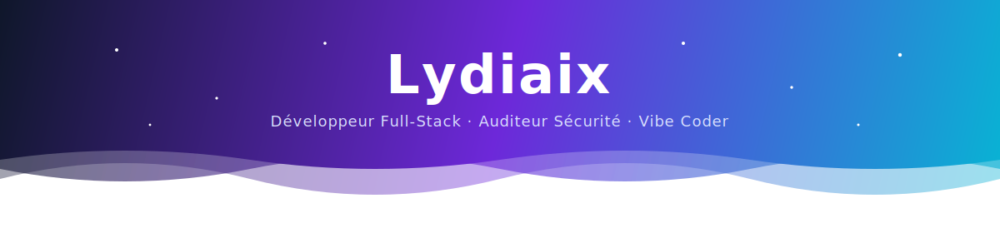

<!-- ═══════════════════════ HEADER ANIMÉ ═══════════════════════ -->

<!-- ═══════════════════════ TYPING ANIMÉ ═══════════════════════ -->

 

<!-- ═══════════════════════ BADGES SOCIAUX ═══════════════════════ -->

<!-- ═══════════════════════ À PROPOS ═══════════════════════ -->

## 👨‍💻 À propos

Développeur **full-stack indépendant**, je conçois et livre des applications web complètes — du cadrage des besoins jusqu'au déploiement en production. Mon socle technique s'articule autour de **TypeScript, React et Node.js**, et j'ai industrialisé un workflow de développement assisté par IA (**Claude**) qui me permet de livrer rapidement, sans transiger sur la qualité ni la maintenabilité du code.

En complément du développement, je réalise des **audits de sécurité applicative** fondés sur le référentiel **OWASP** : analyse du code et des dépendances, identification des vulnérabilités et remise de **correctifs concrets, testés et documentés** — pas seulement un rapport.

### Domaines d'intervention

<table>
  <tr>
    <th width="33%">💻 Développement</th>
    <th width="33%">🛡️ Sécurité</th>
    <th width="33%">🤝 Accompagnement</th>
  </tr>
  <tr>
    <td>Applications web, API et SaaS sur mesure, de la conception à la mise en production.</td>
    <td>Audits OWASP, revue de code, durcissement et plan de remédiation priorisé.</td>
    <td>Architecture, choix techniques et intégration de l'IA dans le cycle de développement.</td>
  </tr>
</table>

> 📌 **Disponible pour de nouvelles missions** — présentez-moi votre projet sur **[lydiaix.fr](https://lydiaix.fr)**

<!-- ═══════════════════════ STACK TECHNIQUE ANIMÉE ═══════════════════════ -->

## 🛠️ Stack & Outils

### 💻 Langages

<table>
  <tr>
    <td align="center" width="110">
      
       <b>TypeScript</b>
    </td>
    <td align="center" width="110">
      
       <b>JavaScript</b>
    </td>
    <td align="center" width="110">
      
       <b>HTML5</b>
    </td>
    <td align="center" width="110">
      
       <b>CSS3</b>
    </td>
  </tr>
</table>

### 🎨 Frontend

<table>
  <tr>
    <td align="center" width="110">
      
       <b>React</b>
    </td>
    <td align="center" width="110">
      
       <b>Next.js</b>
    </td>
    <td align="center" width="110">
      
       <b>Tailwind</b>
    </td>
    <td align="center" width="110">
      
       <b>Vite</b>
    </td>
  </tr>
</table>

### ⚙️ Backend & Data

<table>
  <tr>
    <td align="center" width="110">
      
       <b>Node.js</b>
    </td>
    <td align="center" width="110">
      
       <b>Express</b>
    </td>
    <td align="center" width="110">
      
       <b>REST API</b>
    </td>
    <td align="center" width="110">
      
       <b>PostgreSQL</b>
    </td>
    <td align="center" width="110">
      
       <b>MongoDB</b>
    </td>
  </tr>
</table>

### 🛡️ Sécurité & DevOps

<table>
  <tr>
    <td align="center" width="110">
      
       <b>Docker</b>
    </td>
    <td align="center" width="110">
      
       <b>GitHub</b>
    </td>
    <td align="center" width="110">
      
       <b>Git</b>
    </td>
    <td align="center" width="110">
      
       <b>OWASP</b>
    </td>
    <td align="center" width="110">
      
       <b>JWT</b>
    </td>
  </tr>
</table>

### 🤖 IA & Workflow

<table>
  <tr>
    <td align="center" width="110">
      
       <b>Claude</b>
    </td>
    <td align="center" width="110">
      
       <b>Claude Code</b>
    </td>
  </tr>
</table>

<!-- ═══════════════════════ STATS ANIMÉES ═══════════════════════ -->

## 📊 Statistiques GitHub

 

<!-- ═══════════════════════ GRAPHE D'ACTIVITÉ ANIMÉ ═══════════════════════ -->

<!-- ═══════════════════════ TROPHÉES ANIMÉS ═══════════════════════ -->

 

<!-- ═══════════════════════ SNAKE ANIMÉ ═══════════════════════ -->
<!-- 🐍 Nécessite d'avoir lancé la GitHub Action `snake.yml` une fois (crée la branche `output`) -->

<!-- ═══════════════════════ APPROCHE SÉCURITÉ ═══════════════════════ -->

## 🛡️ Mon approche sécurité

> De l'audit à la mitigation, je sécurise chaque couche de l'application.

| Étape | Ce que je fais |
|-------|----------------|
| 🔍 **Audit** | Analyse complète du code, des dépendances et de la surface d'attaque |
| 🎯 **Threat modeling** | Identification des vecteurs d'attaque selon le référentiel **OWASP Top 10** |
| 🔒 **Durcissement** | Authentification robuste, validation des entrées, gestion des secrets, headers HTTP |
| ✅ **Solutions** | Correctifs concrets, testés et documentés — pas juste un rapport |

<!-- ═══════════════════════ FOOTER ═══════════════════════ -->

### 💬 Discutons de votre projet

  

